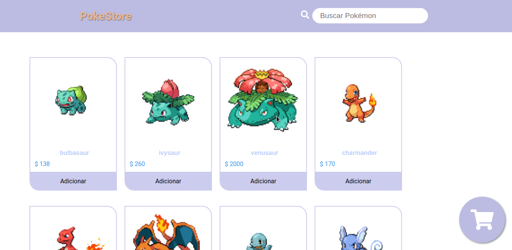

# PokeStore-React
### Desafio proposto durante o programa Hiring Coders da Gama Academy

#### Objetivo
* Construir uma página de uma loja virtual para a venda de Pokémon que irá consumir os dados de uma api já fornecida no enunciado.
[PokeApi](https://pokeapi.co/)

##### Lista de requisitos

* Catálogo de produtos 
* Carrinho lateral
* Resumo do carrinho

##### Bônus

* Barra de busca para filtrar os Pokémon.
* Botão de finalizar compra, reiniciando o processo de compra.
* Modal de obrigado ao finalizar compra.
* Salvar os dados da compra do usuário localmente para não perdê-las ao atualizar a página.

